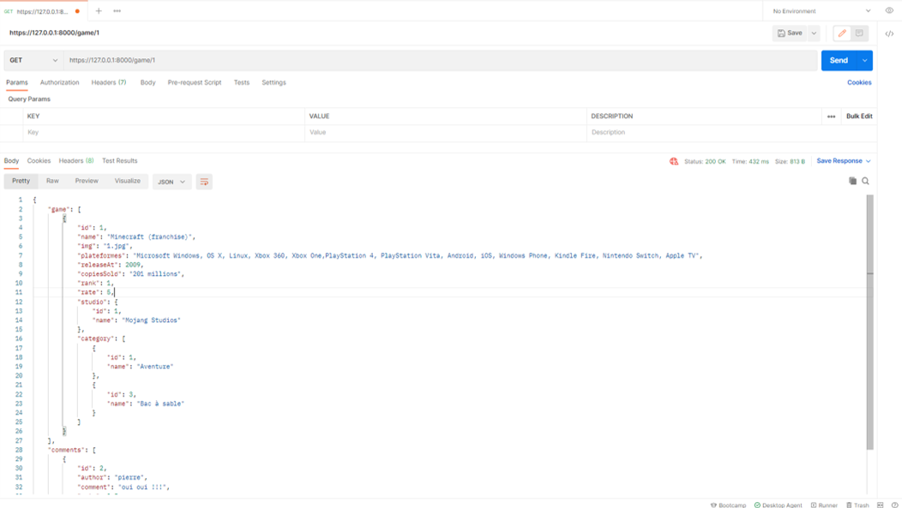
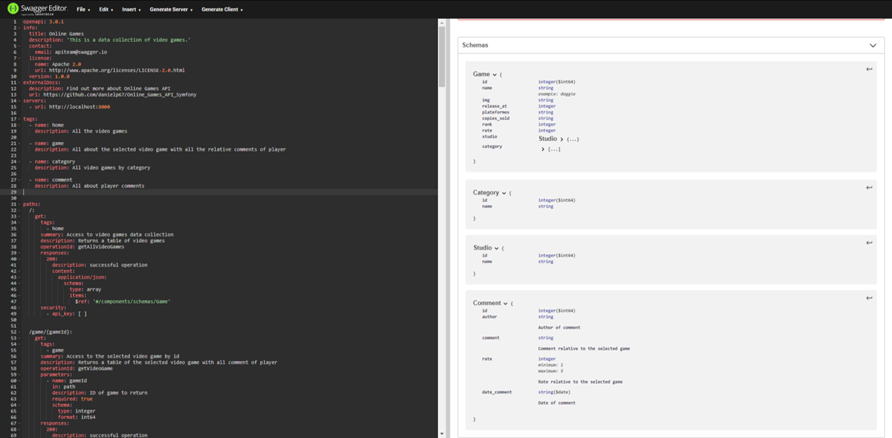
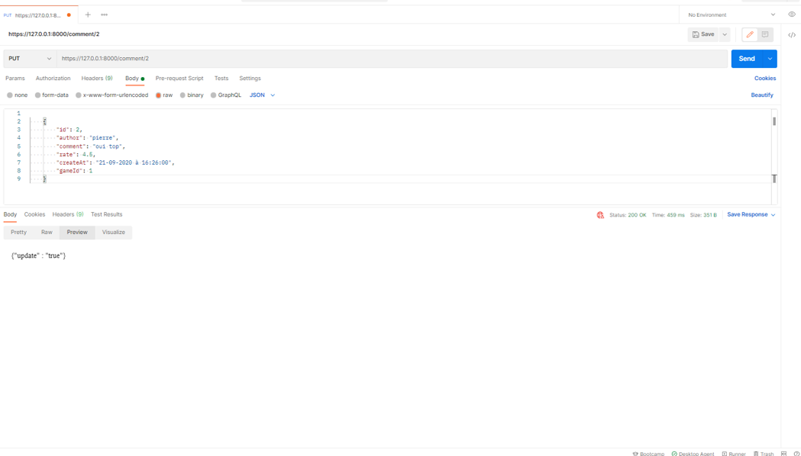
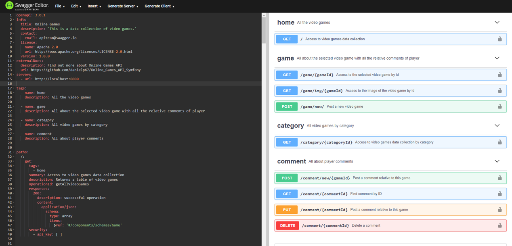

# API Online Games Database

## Target : Create an API in Symfony to communicate DATA with the following projet :

---

Tools :

---
## Development Workflow :

### Phase 1 : Developement of Entity from 14/09/2020 to 20/09/2020

### Phase 2 : Add controllers and test it with Postman from 21/09/2020 to 29/09/2020

---
## Overview :

### Home Page

### Race List Page

### Add New Participant Form

### Race Detail Page

### When you add some Participant for a Race

### Participant List Page

### Category and Profile List Page

### Result Page

