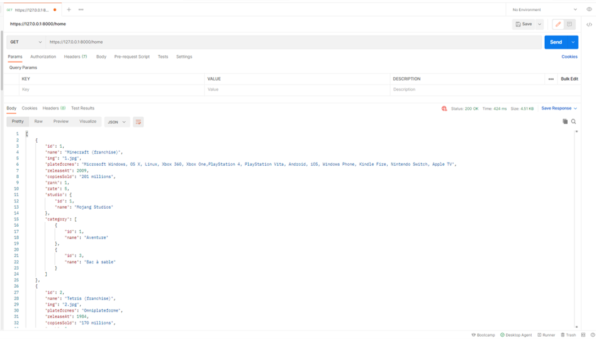

# API Online Games Database

## Target : Create an API in Symfony to communicate DATA with the following projet : 
## [Online_Games_React_JS](https://github.com/danielp67/Online_Games_React_JS)

---

Tools :

---
## Development Workflow :

### Phase 1 : Development of Entity from 14-09-2020 to 20-09-2020

### Phase 2 : Add controllers and test it with Postman and make API documentation with Swagger.io from 21-09-2020 to 29-09-2020

### Phase 3 : Make API documentation with Swagger.io from 29-09-2020 to 29-09-2020

---

## API Documentation

| [Swagger.io](https://editor.swagger.io/?_ga=2.118298831.75571342.1617454134-13766333.1617302106)
| [PDF](doc/api-documentation.pdf)
| [JSON](doc/openapi.json)
| [YAML](doc/api.yaml)
|

## Overview :

### Home Page

### Selected Game

### Add New Comment

### API Documentation with Swagger.io 

